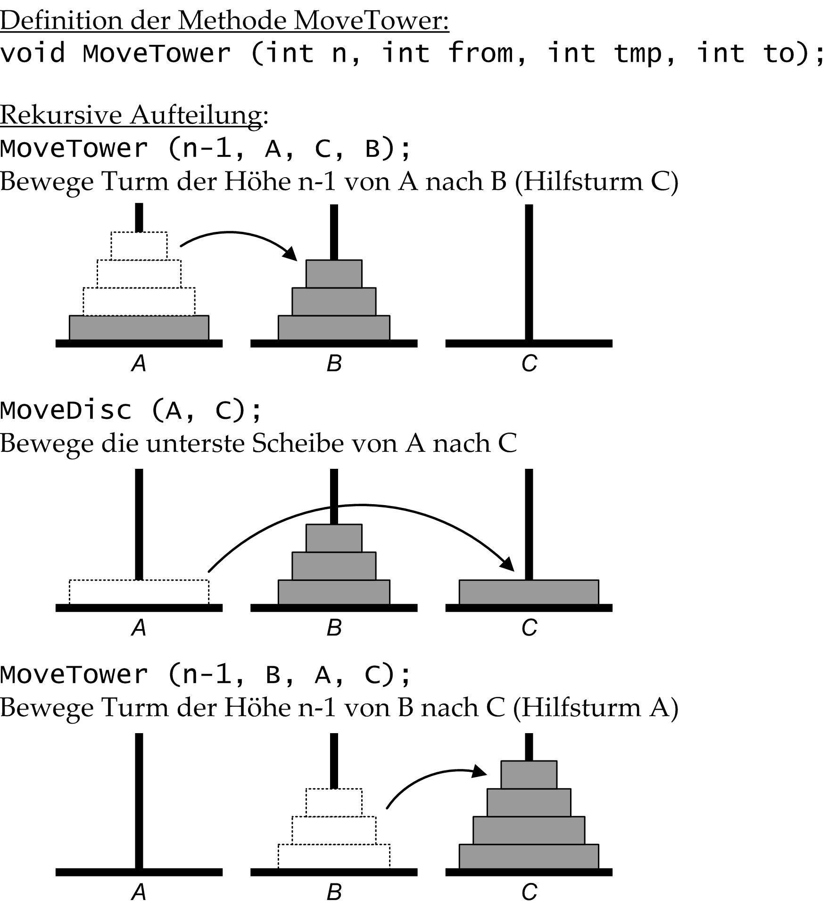
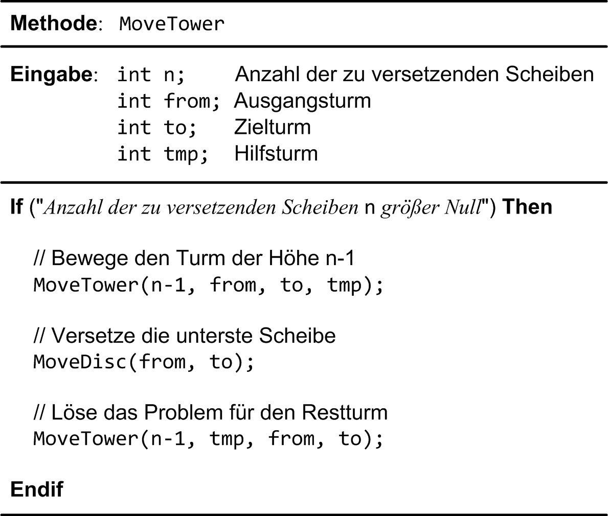
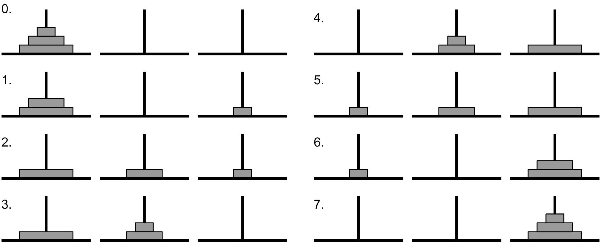
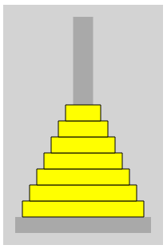

## Die Türme von Hanoi

Das Spiel der *Türme von Hanoi* wird auf den französischen Mathematiker *Edouard Lucas* zurückgeführt, der 1883 folgende kleine Geschichte erfand: Im Großen Tempel von Benares, der die Mitte der Welt markiert, ruht eine Messingplatte, in der drei Diamantnadeln befestigt sind. Bei der Erschaffung der Welt hat Gott vierundsechzig Scheiben aus purem Gold auf eine der Nadeln gesteckt, wobei die größte Scheibe auf der Messingplatte ruht, und die übrigen, immer kleiner werdend, eine auf der anderen.

Die Hindupriester sind nun unablässig damit beschäftigt, die Scheiben dieses Turms von Brahma zu versetzen. Dabei darf immer nur, den Gesetzen von Brahma folgend, eine Scheibe auf einmal umgesetzt werden, und zwar so, dass eine kleinere Scheibe auf eine größere gelegt wird. Wenn alle vierundsechzig Scheiben von dem Stapel, auf die Gott sie bei der Erschaffung der Welt gesetzt hat, auf einen der anderen Plätze gebracht sind, werden der Turm samt dem Tempel und allen Brahmanen zu Staub zerfallen, und die Welt wird untergehen.

Nachdem Sie und ich noch am Leben sind, betrachten wir in dieser Aufgabe eine Simulation dieses Puzzles, die wir in mehreren Teilschritten entwerfen. Die Standardvariante dieses Puzzles verwendet drei Pfähle. Prinzipiell müssen für jeden Lösungsalgorithmus die folgenden zwei Randbedingungen erfüllt sein:

* Es darf zu einem Zeitpunkt nur eine Scheibe bewegt werden.
* Es darf nie eine größere Scheibe auf einer kleineren Scheibe abgelegt werden.

Zu Beginn unserer Simulation dürfen sich auf einem der Pfähle eine bis sieben Scheiben in Pyramidenform auftürmen: Die kleineren Scheiben liegen auf den größeren Scheiben (Abbildung 1). Ein zweiter und ein dritter Pfahl sind in der Ausgangssituation leer. Der zweite Pfahl dient als Hilfspfahl für temporäre Ablagen, um die zweite Randbedingung zu erfüllen. Der dritte Pfahl ist das Ziel der Verschiebungsoperationen.


Abbildung 1. Die Türme von Hanoi: Ausgangs- und Endzustand.

## Einige Hinweise zur Lösung

Der Lösungsansatz setzt das Puzzle auf Basis des *MVC*-Paradigmas (*Model* - *View* - *Controller*) um. Dies ist nicht ganz so einfach, da eine Lösung des Problems auf folgender rekursiven Überlegung basiert:

* Falls der Turm die Höhe *n* hat, bewege den Turm der Höhe *n*-1 zunächst (rekursiv) vom Startpfahl auf den Hilfspfahl
* Bewege die untere, größte Scheibe auf den Zielpfahl
* Bewege den Turm der Höhe *n*-1 (rekursiv) auf den Zielpfahl

Das Problem hat sich nun darauf reduziert, das Puzzle für *n*-1 Scheiben zu lösen. Das lässt sich wiederum auf das Puzzle für *n*-2 Scheiben reduzieren usw., bis schließlich das Problem nur noch für eine einzelne Scheibe zu lösen ist und damit trivial geworden ist. Beachten Sie: Durch diese (rekursive) Strategie werden die zwei eingangs erwähnten Randbedingungen nicht verletzt! Wir skizzieren die rekursive Idee des Algorithmus visuell in Abbildung 2. Dort steht im Mittelpunkt eine Methode MoveTower:


Abbildung 2. Türme von Hanoi: Grundprinzip der rekursiven Strategie.

Durch den Parameter *n* der Methode `MoveTower` aus Abbildung 2 ist die Anzahl der zu verschiebenden Scheiben bezeichnet, mit `from` der Pfahl, von dem die Scheiben entfernt werden, mit `tmp` der Pfahl, der als Zwischenziel dient und mit `to` der Pfahl, der als Ziel dient. Wenn wir den drei Pfählen die Namen **A**, **B** und **C** zuordnen, gehen wir zu Beginn der Simulation davon aus, das sich alle Scheiben auf Pfahl **A** befinden. Ziel der Simulation ist es, den kompletten Scheibenstapel von **A** nach **C** – unter Beachtung der Regeln – zu versetzen. Zur Lösung des Problems wird `MoveTower` mit `from` = **A**, `tmp` = **B** und `to` = **C** aufgerufen.

In einer programmiersprachlichen Notation kann man den Algorithmus mit diesen Überlegungen so formulieren:


Abbildung 3. Pseudocode-Darstellung des Algorithmus.

Wenn es Ihnen hilft, können Sie diesen Algorithmus zunächst in einer Konsolen-Anwendung zum Laufen bringen, bevor Sie mit der Entwicklung des Modells fortfahren. In der Methode `MoveDisc` platzieren Sie ausschließlich einen `print`-Aufruf, etwa der Gestalt

```
void MoveDisc(Towers towerFrom, Towers towerTo) {
  print('Moving disc ' + towerFrom.toString() + ' to ' + towerTo.toString());
}
```

`Towers` ist ein Aufzählungstyp mit folgender Definition:

```
enum Towers { Left, Middle, Right }
```

Die Ausgabe des Programms sieht an einem konkreten Stapel mit 3 Scheiben so aus:

```
Moving disk from 1 to 3
Moving disk from 1 to 2
Moving disk from 3 to 2
Moving disk from 1 to 3
Moving disk from 2 to 1
Moving disk from 2 to 3
Moving disk from 1 to 3
```

Für diese Programmausführung ist ein MoveTower-Aufruf mit den aktuellen Parametern

```
MoveTower(3, Towers.Left, Towers.Middle, Towers.Right);
```

verantwortlich. Aus der rekursiven Darstellung des Algorithmus ist nicht unmittelbar erkennbar, wie die einzelnen Scheiben nun tatsächlich in der Praxis verschoben werden. Dies können Sie nur eruieren, indem Sie für eine konkrete Anzahl von Scheiben die Arbeitsweise der `MoveTower`-Methode Aufruf für Aufruf nachvollziehen. In Abbildung 4 erkennen Sie die Arbeitsweise des Algorithmus an einem Turm der Größe 3:


Abbildung 4. Fallstudie am Beispiel eines Turms der Größe 3.

*Bemerkung*: Für die Anzahl der Bewegungen gibt es eine Formel, bei *n* Scheiben benötigt man 2<sup>*n*</sup> - 1 Züge!

Aus den bisherigen Hilfestellungen - und vor allem aus dem Pseudocode von Abbildung 3 - lässt sich die Implementierung einer Klasse `TowerHanoiModel` ableiten. 

Die öffentlichen Methoden der Klasse ``IntegerSet`` finden Sie in Tabelle 2 vor:

| Methode        | Schnittstelle und Beschreibung |
|:-------------- |-----------------------------------------|
| Konstruktor   | `TowerHanoiModel([int discs]);`<br/> Konstruktor der Klasse `TowerHanoiModel`. Der Parameter `discs` ist optional, die Voreinstellung besitzt den Wert 3. |
| *getter* | `int get NumDiscs;`<br/> Die *getter*-Methode `NumDiscs` liefert die Anzahl der Scheiben zum Startzeitpunkt des Puzzles zurück. |
| `register` | `void register (StateChangeListener listener);`<br/> Benachrichtigungen in einem `TowerHanoiModel`-Objekt erfolgen ereignisgesteuert. Zum Anmelden einer Rückrufmethode (Callback-Funktion) gibt es die `register`-Methode. Der Parametertyp `StateChangeListener` ist definiert als <br/> `typedef StateChangeListener = void Function(Towers tower, Direction direction);` <br/> mit den beiden Aufzählungstypen <br/> `enum Towers { Left, Middle, Right }`  <br/> und  <br/> `enum Direction { Up, Down }` |
| `unregister` | `void unregister (StateChangeListener listener);`<br/> Dienst zum Abmelden einer Rückrufmethode (Callback-Funktion). Die Callback-Funktion muss zuvor mit `register` angemeldet worden sein. |
| `register` | `void register (StateChangeListener listener);`<br/> Benachrichtigungen in einem `TowerHanoiModel`-Objekt erfolgen ereignisgesteuert. Zum Anmelden einer Rückrufmethode (Callback-Funktion) dient die `register`-Methode. |
| `doSimulation`     | `void doSimulation();`<br/> Startet (rekursiv) eine Simulation (siehe Abbildung 3). Die angemeldete Rückrufmethode wird in zyklischen Zeitabständen aufgerufen. |
Tabelle 1. Öffentliche Elemente der Klasse `TowerHanoiModel`.

In der Entwicklung einer Sicht (*View*) greifen wir auf ein HTML5 `Canvas` Steuerelement zurück. Dabei gilt es die Entscheidung zu treffen, alle drei Türme oder nur einen Turm pro Steuerelement zu realisieren. Ich habe mich für *einen* Turm entschieden, siehe dazu ein Beispiel in Abbildung 5:


Abbildung 5. Steuerelement TowerHanoiView: Pfahl mit mehreren Scheiben.

Ein `TowerHanoiView`-Steuerelement visualisiert sowohl den Pfahl als auch eine Reihe von Scheiben mit einem Loch in der Mitte, die auf dem Pfahl abgelegt werden können. Dieses Steuerelement kann nicht isoliert für sich alleine als reine Dart-Klasse realisiert werden, es benötigt ein `Canvas` Steuerelement, das in dreifacher Ausfertigung in einer HTML-Datei definiert wird:

```
<html>
...
<body>
  <h1>Towers of Hanoi Simulation</h1>
  <div>
    <canvas id="left" width="200px" height="300px"></canvas>
    <canvas id="middle" width="200px" height="300px"></canvas>
    <canvas id="right" width="200px" height="300px"></canvas>
  </div>
</html>
```

WEITER: Tabelle weiter


| Methode        | Schnittstelle und Beschreibung |
|:-------------- |-----------------------------------------|
| Konstruktor   | `TowerHanoiModel([int discs]);`<br/> Konstruktor der Klasse `TowerHanoiModel`. Der Parameter `discs` ist optional, die Voreinstellung besitzt den Wert 3. |
| *getter* | `int get NumDiscs;`<br/> Die *getter*-Methode `NumDiscs` liefert die Anzahl der Scheiben zum Startzeitpunkt des Puzzles zurück. |
| `register` | `void register (StateChangeListener listener);`<br/> Benachrichtigungen in einem `TowerHanoiModel`-Objekt erfolgen ereignisgesteuert. Zum Anmelden einer Rückrufmethode (Callback-Funktion) gibt es die `register`-Methode. Der Parametertyp `StateChangeListener` ist definiert als <br/> `typedef StateChangeListener = void Function(Towers tower, Direction direction);` <br/> mit den beiden Aufzählungstypen <br/> `enum Towers { Left, Middle, Right }`  <br/> und  <br/> `enum Direction { Up, Down }` |
| `unregister` | `void unregister (StateChangeListener listener);`<br/> Dienst zum Abmelden einer Rückrufmethode (Callback-Funktion). Die Callback-Funktion muss zuvor mit `register` angemeldet worden sein. |
| `register` | `void register (StateChangeListener listener);`<br/> Benachrichtigungen in einem `TowerHanoiModel`-Objekt erfolgen ereignisgesteuert. Zum Anmelden einer Rückrufmethode (Callback-Funktion) dient die `register`-Methode. |
| `doSimulation`     | `void doSimulation();`<br/> Startet (rekursiv) eine Simulation (siehe Abbildung 3). Die angemeldete Rückrufmethode wird in zyklischen Zeitabständen aufgerufen. |
Tabelle 2. Öffentliche Elemente der Klasse `TowerHanoiView`.

