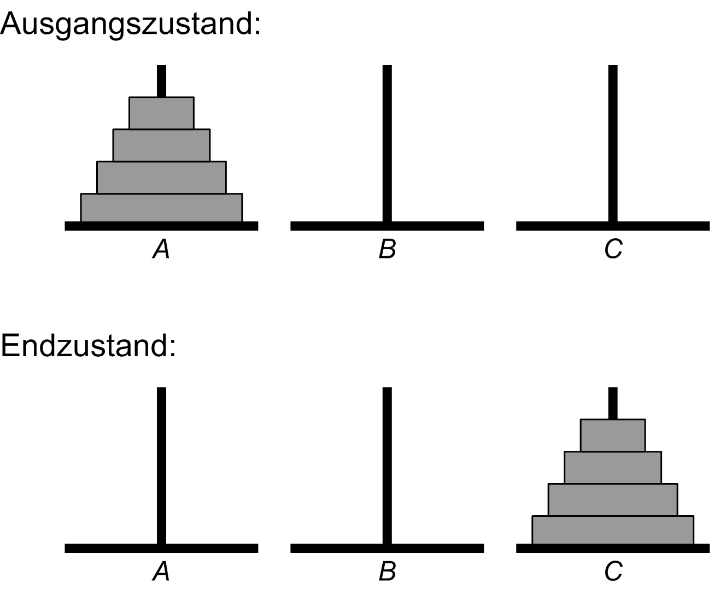

## Die Türme von Hanoi

Das Spiel der **Türme von Hanoi** wird auf den französischen Mathematiker **Edouard Lucas** zurückgeführt, der 1883 folgende kleine Geschichte erfand: Im Großen Tempel von Benares, der die Mitte der Welt markiert, ruht eine Messingplatte, in der drei Diamantnadeln befestigt sind. Bei der Erschaffung der Welt hat Gott vierundsechzig Scheiben aus purem Gold auf eine der Nadeln gesteckt, wobei die größte Scheibe auf der Messingplatte ruht, und die übrigen, immer kleiner werdend, eine auf der anderen.

Die Hindupriester sind nun unablässig damit beschäftigt, die Scheiben dieses Turms von Brahma zu versetzen. Dabei darf immer nur, den Gesetzen von Brahma folgend, eine Scheibe auf einmal umgesetzt werden, und zwar so, dass eine kleinere Scheibe auf eine größere gelegt wird. Wenn alle vierundsechzig Scheiben von dem Stapel, auf die Gott sie bei der Erschaffung der Welt gesetzt hat, auf einen der anderen Plätze gebracht sind, werden der Turm samt dem Tempel und allen Brahmanen zu Staub zerfallen, und die Welt wird untergehen.

Nachdem Sie und ich noch am Leben sind, betrachten wir in dieser Aufgabe eine Simulation dieses Puzzles, die wir in mehreren Teilschritten entwerfen. Die Standardvariante dieses Puzzles verwendet drei Pfähle. Prinzipiell müssen für jeden Lösungsalgorithmus die folgenden zwei Randbedingungen erfüllt sein:

* Es darf zu einem Zeitpunkt nur eine Scheibe bewegt werden.
* Es darf nie eine größere Scheibe auf einer kleineren Scheibe abgelegt werden.

Zu Beginn unserer Simulation dürfen sich auf einem der Pfähle eine bis sieben Scheiben in Pyramidenform auftürmen: Die kleineren Scheiben liegen auf den größeren Scheiben (Abbildung 1). Ein zweiter und ein dritter Pfahl sind in der Ausgangssituation leer. Der zweite Pfahl dient als Hilfspfahl für temporäre Ablagen, um die zweite Randbedingung zu erfüllen. Der dritte Pfahl ist das Ziel der Verschiebungsoperationen.

Abbildung 1. Die Türme von Hanoi: Ausgangs- und Endzustand.

